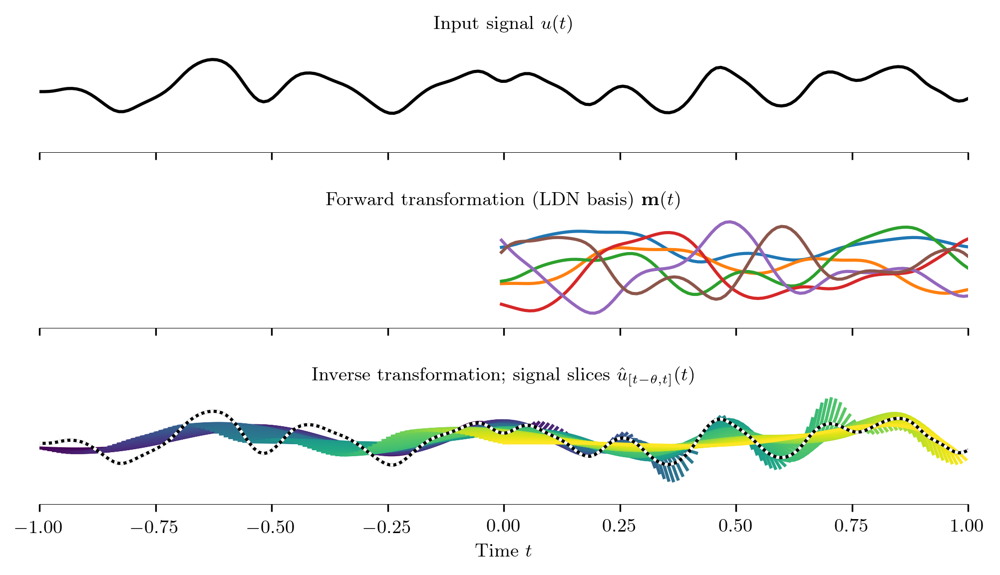

# Temporal Basis Transformation Network

This repository implements a TensorFlow Keras layer for temporal
convolution with a set of FIR filters.
These FIR filters may form a temporal basis transformation; hence the name of this network.

This layer can for example be used to construct temporal convolution network networks.
Although the code was mostly designed with fixed temporal convolutions (such as the Fourier or LDN bases) in mind.



**Features:**
* Easier to use than `tf.convolve`, works with any number of batch dimensions
* Built in *forward* and *inverse* mode
* Optional padding of the input to preserve the input sequence length
* Trainable convolution with weight normalization

This code has been tested with TensorFlow 2.4, 2.5 and Python 3.8.
It has been designed in conjunction with the [`dlop_ldn_function_bases`](https://github.com/astoeckel/dlop_ldn_function_bases) package, which can be used to generate basis transformations.


## Installation

You can simply install this package via `pip`. For example, run

```sh
pip3 install --user -e .
```

Depending on your environment, you may need to use `pip` instead of `pip3`. Also, if you're inside a virtual environment, you may have to skip the `--user` argument.


## Usage

### 📖 [Read the inline documentation](https://github.com/ctn-waterloo/temporal_basis_transformation_network/blob/main/temporal_basis_transformation_network/keras.py#L25) 

The following is a very basic usage example; a sequence of N = 100 temporal samples is compressed into q = 20 generalised Fourier coefficients and a single temporal sample.

```python
# TensorFlow 2.4 or later
import tensorflow as tf

# Import the TemporalBasisTrafo layer from this package
from temporal_basis_transformation_network.keras import TemporalBasisTrafo

# See https://github.com/astoeckel/dlop_ldn_function_bases
import dlop_ldn_function_bases as bases

# Generate a Legendre Delay Network basis
q, N = 20, 100 # Compress N=100 samples into q=20 dimensions
H = bases.mk_ldn_basis(q=q, N=N)

# Build a simple model with a linear readout
model = tf.keras.models.Sequential([
    # [..., N, units] ==> [..., 1, units * q]
    TemporalBasisTrafo(H=H, units=1),

    # [..., 1, q] ==> [..., 1, 1]
    tf.keras.layers.Dense(1, activation='linear', use_bias=False)
])

# Compile, fit, evaluate the model as usual...
```

### Input and output dimensions
The `TemporalBasisTrafo` layer can be thought of as "consuming" *N - 1* temporal samples
and outputting *q* spatial dimensions instead.

To be more precise, the input and output dimensions of the layer are generally of the following form
```
Input: [...batch dimensions, M, units]
```
where *M* is the set of temporal samples, and *units* corresponds to the number of input units.

The number of output dimensions will be
```
Output: [...batch dimensions, M', q * units]
```
where `M' = max(1, M - N + 1)` and *q* and *N* are as defined in the above code example.

There are quite a few configuration options in the constructor that affect the number of input and output dimensions.
These include `pad`, `mode` and `collapse`.
Take a look at [`temporal_basis_transformation_networkkeras.py`](https://github.com/ctn-waterloo/temporal_basis_transformation_network/blob/main/temporal_basis_transformation_network/keras.py#L25) for a more detailed description.


## Dependencies

This code has no dependencies apart from TensorFlow 2.4 or later and numpy
1.19 or later.

However, to run the unit tests or to play around with the Jupyter notebooks
in the `notebooks` folder, you need to install `scipy`, and
`matplotlib`, as well as the `dlop_ldn_function_bases` package, which
can be found [here](https://github.com/astoeckel/dlop_ldn_function_bases).


## Testing

Unit tests use `pytest`. Run
```sh
pip3 install pytest
```
to install `pytest` if it isn't already available on your system.

Simply run `pytest` from the main directory of this repository to run the
unit tests.


## License
Temporal Basis Transformation Network  
Copyright (C) 2020, 2021  Andreas Stöckel

This program is free software: you can redistribute it and/or modify
it under the terms of the GNU Affero General Public License as
pblished by the Free Software Foundation, either version 3 of the
License, or (at your option) any later version.

This program is distributed in the hope that it will be useful,
but WITHOUT ANY WARRANTY; without even the implied warranty of
MERCHANTABILITY or FITNESS FOR A PARTICULAR PURPOSE.  See the
GNU Affero General Public License for more details.

You should have received a copy of the GNU Affero General Public License
along with this program.  If not, see <https://www.gnu.org/licenses/>.
